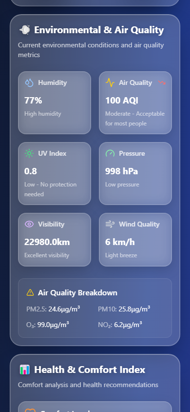

# 🌤️ Beautiful Weather App

A modern, responsive weather web application built with React, TypeScript, and Tailwind CSS. Features beautiful glass morphism design, interactive charts, and comprehensive weather data from the Open-Meteo API.



## ✨ Features

- **🎨 Beautiful Glass Morphism UI** - Modern design with backdrop blur effects
- **📱 Mobile-First Responsive** - Optimized for all screen sizes
- **📊 Interactive Charts** - Temperature and precipitation data visualization
- **🌍 Geolocation Support** - Automatic location detection with fallback
- **📅 7-Day Forecast** - Detailed weekly weather outlook
- **⚡ Real-Time Data** - Live weather updates from Open-Meteo API
- **🎭 Smooth Animations** - Polished user experience with subtle transitions
- **♿ Accessible Design** - Proper color contrast and keyboard navigation

## 🛠️ Tech Stack

- **React 18** with TypeScript
- **Vite** for fast development and building
- **Tailwind CSS** for utility-first styling
- **Lucide React** for beautiful icons
- **Chart.js** with react-chartjs-2 for data visualization
- **Open-Meteo API** for weather data
- **date-fns** for date manipulation

## 🚀 Quick Start

1. **Clone and install dependencies:**
   ```bash
   npm install
   ```

2. **Start the development server:**
   ```bash
   npm run dev
   ```

3. **Open your browser and visit:**
   ```
   http://localhost:5173
   ```

## 📁 Project Structure

```
src/
├── components/           # React components
│   ├── CurrentWeather.tsx    # Main weather display
│   ├── TemperatureChart.tsx  # Temperature graph
│   ├── PrecipitationChart.tsx # Rain forecast chart
│   ├── WeeklyForecast.tsx    # 7-day forecast
│   ├── WeatherIcon.tsx       # Weather condition icons
│   ├── LoadingSpinner.tsx    # Loading states
│   └── ErrorMessage.tsx      # Error handling
├── services/            # API services
│   └── weatherService.ts     # Weather API integration
├── types/               # TypeScript definitions
│   └── weather.ts           # Weather data interfaces
├── utils/               # Utility functions
│   └── weatherUtils.ts      # Weather data formatting
└── App.tsx             # Main application component
```

## 🌡️ Weather Data

The app displays comprehensive weather information including:

- **Current Conditions**: Temperature, feels like, humidity, pressure, wind
- **Hourly Forecast**: 24-hour temperature and precipitation charts
- **Daily Forecast**: 7-day outlook with high/low temperatures
- **Weather Details**: Cloud cover, visibility, wind direction
- **Precipitation**: Rain probability and accumulation

## 🎨 Design Features

- **Glass Morphism**: Beautiful translucent cards with backdrop blur
- **Gradient Backgrounds**: Dynamic blue gradient backgrounds
- **Smooth Animations**: Fade-in and slide-up animations
- **Interactive Charts**: Responsive Chart.js visualizations
- **Responsive Grid**: Adaptive layout for all screen sizes
- **Accessible Colors**: High contrast text and interactive elements

## 🔧 Available Scripts

- `npm run dev` - Start development server
- `npm run build` - Build for production
- `npm run preview` - Preview production build
- `npm run lint` - Run ESLint

## 🌐 API Integration

The app uses the [Open-Meteo API](https://open-meteo.com/) which provides:
- Free weather data with no API key required
- Comprehensive weather parameters
- 7-day forecasts
- Hourly data resolution
- Global coverage

## 📱 Mobile Experience

The app is designed mobile-first with:
- Touch-friendly interface
- Optimized loading states
- Readable text on small screens
- Efficient data usage
- Offline error handling

## 🤝 Contributing

1. Fork the repository
2. Create a feature branch
3. Make your changes
4. Add tests if applicable
5. Submit a pull request

## 📄 License

This project is open source and available under the [MIT License](LICENSE).

## 🙏 Acknowledgments

- [Open-Meteo](https://open-meteo.com/) for free weather data
- [Lucide](https://lucide.dev/) for beautiful icons
- [Chart.js](https://www.chartjs.org/) for data visualization
- [Tailwind CSS](https://tailwindcss.com/) for styling utilities

## 🛠️ ESLint Configuration

You can also install [eslint-plugin-react-x](https://github.com/Rel1cx/eslint-react/tree/main/packages/plugins/eslint-plugin-react-x) and [eslint-plugin-react-dom](https://github.com/Rel1cx/eslint-react/tree/main/packages/plugins/eslint-plugin-react-dom) for React-specific lint rules:

```js
// eslint.config.js
import reactX from 'eslint-plugin-react-x'
import reactDom from 'eslint-plugin-react-dom'

export default tseslint.config({
  plugins: {
    // Add the react-x and react-dom plugins
    'react-x': reactX,
    'react-dom': reactDom,
  },
  rules: {
    // other rules...
    // Enable its recommended typescript rules
    ...reactX.configs['recommended-typescript'].rules,
    ...reactDom.configs.recommended.rules,
  },
})
```
